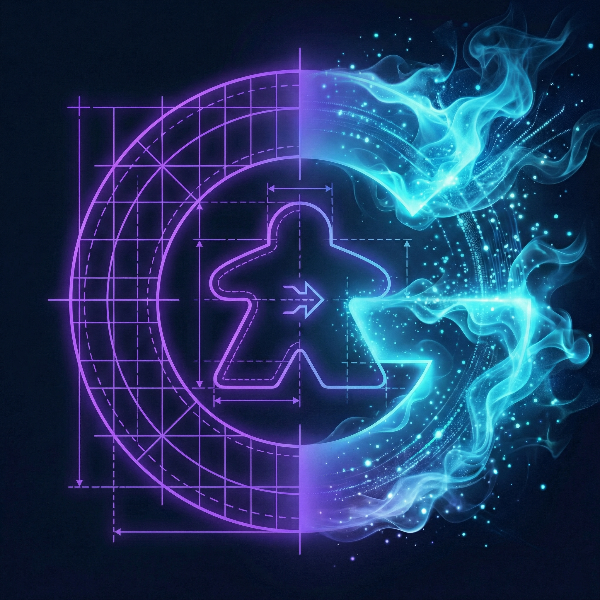
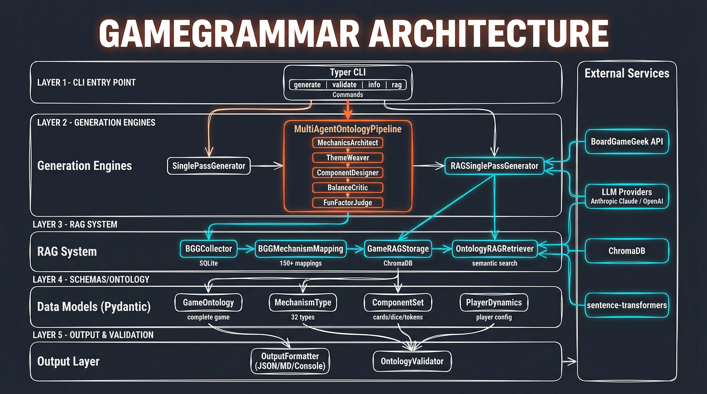

<p align="center">
  
</p>

# GameGrammar

Generative Ontology for Board Game Design using DSPy.

GameGrammar uses structured AI generation to create complete board game designs from thematic prompts. It enforces design constraints and ensures mechanism coherence through a multi-agent pipeline.

## Architecture

GameGrammar transforms a theme and constraints into a complete, playable game design through a pipeline of specialized AI agents. Each agent focuses on one aspect of game design, passing its output to the next. The pipeline ensures mechanical coherence, thematic integration, and design quality through built-in critique stages.



### Multi-Agent Pipeline

The `--multi-agent` flag activates the full pipeline. Agents execute sequentially, each building on previous outputs:

1. **Mechanics Architect** - Selects and justifies game mechanisms
2. **Theme Weaver** - Integrates theme with mechanics, generates victory conditions
3. **Component Designer** - Specifies physical components
4. **Balance Critic** - Analyzes potential balance issues
5. **Fun Factor Judge** - Assesses engagement and rates fun factor

Without `--multi-agent`, a single-pass generator creates the entire design in one LLM call—faster but with less nuanced output.

### RAG Components

When using `--rag`, the system also includes:

- **BGG Collector** - Fetches game data from BoardGameGeek API
- **Mechanism Mapper** - Maps 150+ BGG mechanisms to GameGrammar types
- **Vector Storage** - ChromaDB with sentence-transformer embeddings
- **RAG Retriever** - Semantic search with constraint filtering
- **RAG Generator** - DSPy module that incorporates similar games context

## Installation

```bash
uv sync
```

## Usage

### List Available Mechanisms

```bash
uv run gamegrammar list-mechanisms
```

### Generate a Game

```bash
# Set your API key
export ANTHROPIC_API_KEY=your_key_here

# Generate a game
uv run gamegrammar generate \
  --theme "Rival astronomers racing to name celestial objects" \
  --constraints "2-4 players, competitive, medium complexity"
```

### Validate a Game Design

```bash
uv run gamegrammar validate --file game.json
```

## RAG-Enhanced Generation

GameGrammar supports Retrieval-Augmented Generation (RAG) using real game data from BoardGameGeek. This grounds generation in proven design patterns from existing games.

### Setup BGG API Token

BGG requires API authentication. Register for a token:

1. Go to https://boardgamegeek.com/applications
2. Create a "Non-commercial" application
3. Once approved, get your token from the Tokens section
4. Set the environment variable:

```bash
export BGG_API_TOKEN=your_token_here
```

### Collect and Index Games

```bash
# Collect games from BGG (requires token)
uv run gamegrammar rag collect --limit 100

# Index collected games into ChromaDB
uv run gamegrammar rag index

# Check status
uv run gamegrammar rag stats
```

### Search Games

```bash
# Semantic search for similar games
uv run gamegrammar rag search -q "cooperative deck building" -n 5
```

### Generate with RAG

```bash
# Generate informed by similar existing games
uv run gamegrammar generate \
  --theme "Space exploration trading" \
  --constraints "2-4 players, medium complexity" \
  --rag
```

## Options

- `--theme`, `-t` - Thematic concept for the game (or path to a file containing it)
- `--constraints`, `-c` - Design constraints (or path to a file containing them)
- `--output`, `-o` - Output format: `json`, `markdown`, `console` (default: console). Can be specified multiple times to output multiple formats simultaneously.
- `--file`, `-f` - Write output to file instead of stdout
- `--model` - LLM model to use (default: anthropic/claude-sonnet-4-20250514)
- `--verbose` - Show agent reasoning
- `--multi-agent` - Use multi-agent pipeline vs single-pass
- `--rag` - Use RAG-enhanced generation with similar games context

### File Inputs

Both `--theme` and `--constraints` accept file paths. If the value is an existing file, its contents are read automatically:

```bash
# Create reusable theme and constraints files
echo "Rival astronomers racing to name celestial objects" > theme.txt
echo "2-4 players, competitive, heavy complexity, area control" > constraints.txt

# Generate using files
uv run gamegrammar generate \
  --theme theme.txt \
  --constraints constraints.txt \
  -o json -o markdown \
  --file celestial-clash
```

This makes it easy to iterate on designs without retyping long prompts.

### Multi-Format Output

Generate multiple output formats in a single run:

```bash
# Output both JSON and Markdown to stdout
uv run gamegrammar generate \
  --theme "Space pirates" \
  -o json -o markdown

# Write both formats to files (auto-generates extensions)
uv run gamegrammar generate \
  --theme "Space pirates" \
  -o json -o markdown \
  --file game
# Creates: game.json and game.md
```

## Environment Variables

- `ANTHROPIC_API_KEY` - Anthropic API key (required for generation)
- `OPENAI_API_KEY` - OpenAI API key (alternative to Anthropic)
- `BGG_API_TOKEN` - BoardGameGeek API token (required for `rag collect`)
- `GAMEGRAMMAR_MODEL` - Override default model

## Development

```bash
# Install with dev dependencies
uv sync --extra dev

# Run tests
uv run pytest
```

